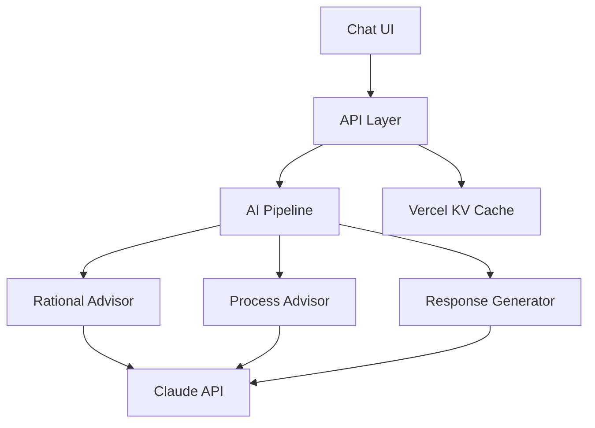

# AI Mentor App - Developer Documentation

## Architecture Overview

Typescript-based Next.js application deployed on Vercel with AI processing pipeline powered by Claude.

### Core Components



## Frontend Structure

### Current Implementation
- `/src/components/chat/*` - Chat interface components
- `/src/hooks/useChat.ts` - Chat state management
- `/src/services/*` - API integration

### Required
- Authentication UI
- Profile management
- Premium features interface
- Progress tracking UI

## Backend System

### AI Pipeline
```typescript
AIPipeline
├─ RationalAdvisor
│  └─ analyze(input, context)
├─ ProcessAdvisor
│  └─ analyze(input, context)
└─ ResponseGenerator
   └─ generate(input, analyses)
```

### Data Flow
1. User input → API endpoint
2. Cache check (Vercel KV)
3. Parallel advisor analysis
4. Response generation
5. Cache storage
6. Streaming response

## State Management

### Current
- Zustand for chat state
- Local storage for preferences

### Required
- User session management
- Subscription state
- Progress tracking

## API Routes

### Implemented
- `/api/chat` - Main chat endpoint

### Required
- `/api/auth/*` - Authentication
- `/api/profile/*` - User management
- `/api/subscription/*` - Premium features

## Development Setup

```bash
# Install dependencies
npm install

# Environment variables
cp .env.example .env.local

# Run development server
npm run dev
```

## Next Steps

### Critical Path
1. Authentication system
2. Data persistence
3. Error handling improvements
4. Testing infrastructure

### Enhancement Path
1. Advanced analytics
2. Premium features
3. Enterprise capabilities

## Testing Strategy

### Required Tests
- AI pipeline unit tests
- Chat interface integration tests
- API endpoint tests
- Performance testing

## Monitoring

### Implemented
- Vercel Analytics
- Sentry error tracking

### Required
- Response time monitoring
- AI quality metrics
- User behavior analytics

## Contributing

### Workflow
1. Branch from `main`
2. Implement feature
3. Add tests
4. Create PR
5. Deploy preview
6. Review & merge

### Code Style
- ESLint configuration
- Prettier formatting
- TypeScript strict mode

## Environment Variables

### Required
```env
ANTHROPIC_API_KEY=
NEXT_PUBLIC_VERCEL_ANALYTICS_ID=
SENTRY_DSN=
```

## Performance Goals

### Targets
- Initial response: < 200ms
- AI processing: < 2s
- Cache hit ratio: > 80%
- Error rate: < 0.1%