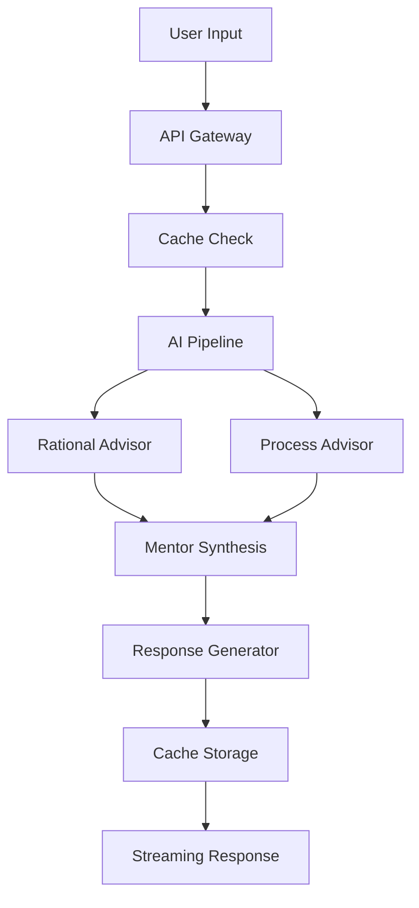

# System Design

## Core Architecture

### AI Pipeline


### Data Flow
1. Input Processing
   - Message sanitization
   - Context enrichment
   - Cache lookup

2. AI Analysis
   - Parallel advisor execution
   - Context aggregation
   - Emotional analysis

3. Response Generation
   - Content synthesis
   - Format optimization
   - Streaming chunks

### Performance Optimization

#### Caching Strategy
```typescript
interface CacheConfig {
  ttl: number;          // Default: 3600s
  maxSize: number;      // Default: 100MB
  priority: 'speed' | 'freshness';
}

interface CacheKey {
  input: string;        // User message
  contextHash: string;  // Context fingerprint
  timestamp: number;    // Cache time
}
```

#### Memory Management
- Streaming response buffering
- Context pruning
- Cache eviction policies

### Error Handling

#### Recovery Strategies
1. Automatic retries with backoff
2. Fallback responses
3. Graceful degradation

#### Error Types
```typescript
enum ErrorType {
  AI_PROCESSING = 'ai_processing',
  RATE_LIMIT = 'rate_limit',
  CONTEXT_OVERFLOW = 'context_overflow',
  STREAM_INTERRUPT = 'stream_interrupt'
}
```

### Scalability Considerations

1. Load Distribution
   - Request queuing
   - Rate limiting
   - Priority processing

2. Resource Management
   - Token budgeting
   - Concurrent request limiting
   - Cache size optimization